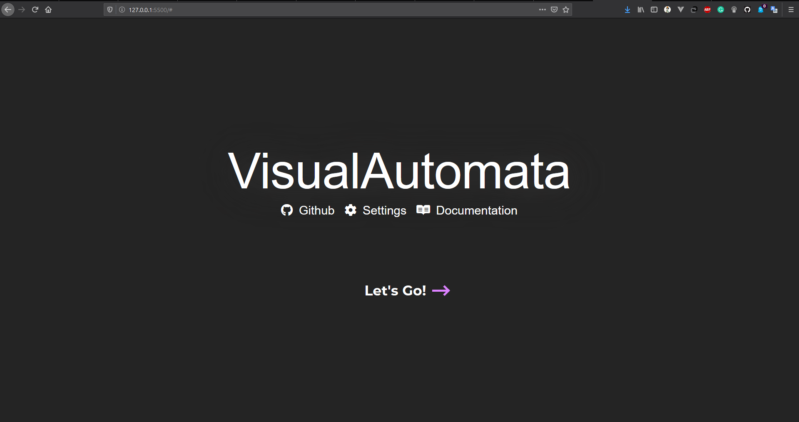
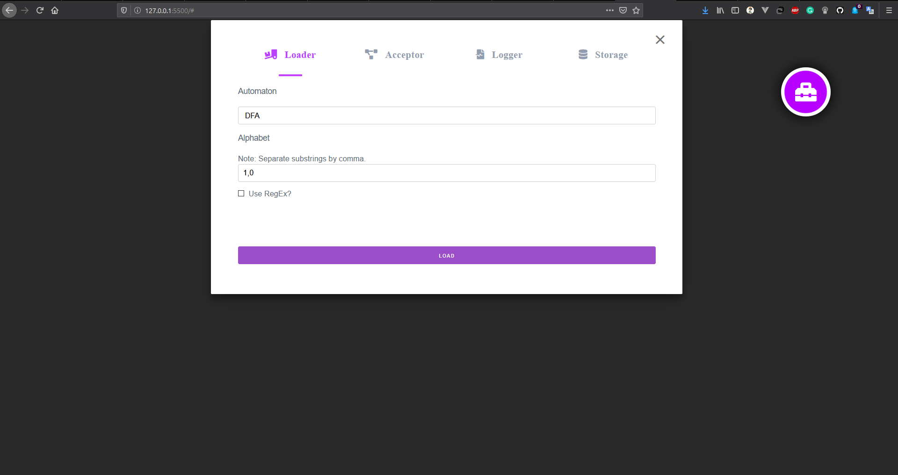
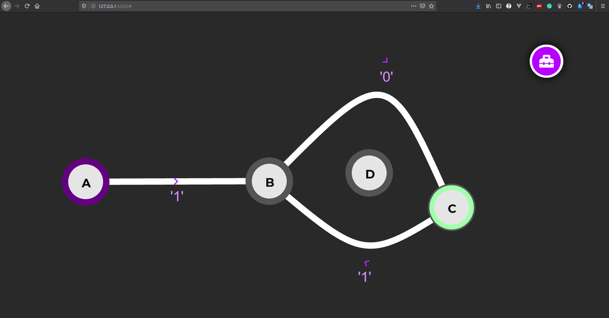

# VisualAutomata
A front-end only application that generates, displays and animates a subset of the classical state machines.

**Features**:
- Interactive generation & visualisation of DFA, NFA, E-NFA and PDA.
- Animation of the process of acceptance for each of the state machines.
- Where possible, automatic conversion between state machines.

## Try It Out
Since everything is done on the client, [hop straight in](https://gitpaulo.github.io/VisualAutomata/)!

## To do

- [x] GUI interface
- [x] DFA, NFA, e-NFA implementation
- [x] Graphical components
- [x] NFA -> DFA conversion
- [ ] e-NFA -> NFA conversion
- [ ] Implement PDA

## Preview

